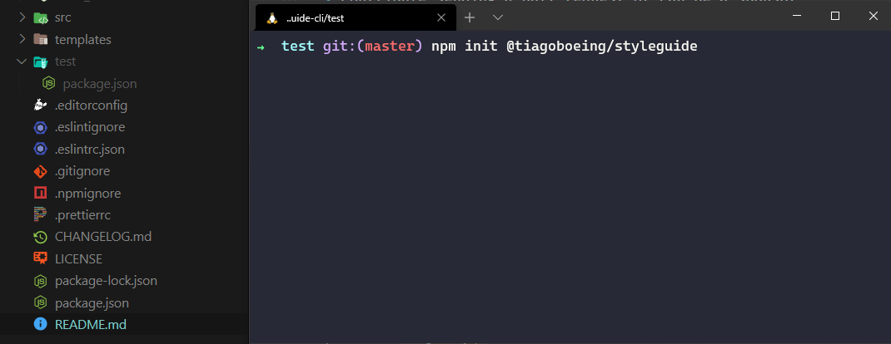

# Style Guide CLI

   

A CLI to add ESLint + Prettier and enforce a style guide based on `ESLint standard`. **This automatize dependencies install and Prettier + ESLint configs**, adding specific files for different frameworks/languages (in case of JS or TS).



## Framework/language support

| Framework / Language                      | Support? |
| ----------------------------------------- | -------- |
| Angular 2+                                | ✅ Yes    |
| JavaScript (Browser + Node)               | ✅ Yes    |
| React / Next.js                           | ✅ Yes    |
| TypeScript (use Angular template for now) | Roadmap  |

> Contribute sending a pull request or can be a sponsor

## SO support

| SO      | Support?   |
| ------- | ---------- |
| Linux   | ✅ Yes      |
| Windows | ✅ Yes      |
| MacOS   | Not tested |

> You can edit this README if test on MacOS. 😁

## Use

Before run, remove following files from your project root if exists:

- `.editorconfig`
- `.eslintignore`
- `.eslintrc.json`
- `.prettierrc`

Run the command on root of your project. (Same folder of `package.json`)

```bash
$ npm init @tiagoboeing/styleguide

# or

$ npx @tiagoboeing/create-styleguide

# or

$ npm i -g @tiagoboeing/create-styleguide
$ create-styleguide

# after run, select a option and be happy! 🎉
? What the type of your project?
❯ JavaScript
  Angular 2+
  React / Next.js (TypeScript)
```

> Before execute, do a backup or commit your files!

## Development

To run local exists two strategies:

1. Using directly `NPM`

```bash
# on root folder, run for register CLI on envs
$ npm link

# create any folder to run the CLI
$ mkdir test
$ cd test

# start a Node project to create a package.json
$ npm init -y

# and... run the CLI for apply magic 🚀
$ create-styleguide
```

2. Using VSCode automated tasks (`tasks.json` and `launch.json`)

Press F5 key to run or use Ctrl + Shift + D to access run side menu and select "Launch" on context menu to run the all predefined tasks.

On `.vscode/tasks.json` you can change the CLI args in:

```json
...
"args": [
  "--project",
  "javascript" <- here
],
```

## Defaults

> Same configs for all projects types

<details>
<summary>Prettier</summary>
<p>

```json
{
  "$schema": "http://json.schemastore.org/prettierrc",
  "semi": false,
  "singleQuote": true,
  "arrowParens": "avoid",
  "trailingComma": "none",
  "endOfLine": "auto",
  "tabWidth": 2,
  "printWidth": 95
}
```
</p>
</details>

<details>
<summary>.editorconfig</summary>
<p>

```conf
# Editor configuration, see https://editorconfig.org
root = true

[*]
indent_style = space
indent_size = 2
charset = utf-8
end_of_line = lf
trim_trailing_whitespace = true
insert_final_newline = true

[*.md]
max_line_length = off
trim_trailing_whitespace = false

```
</p>
</details>
